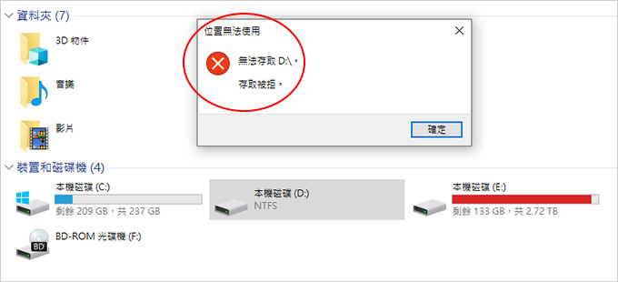
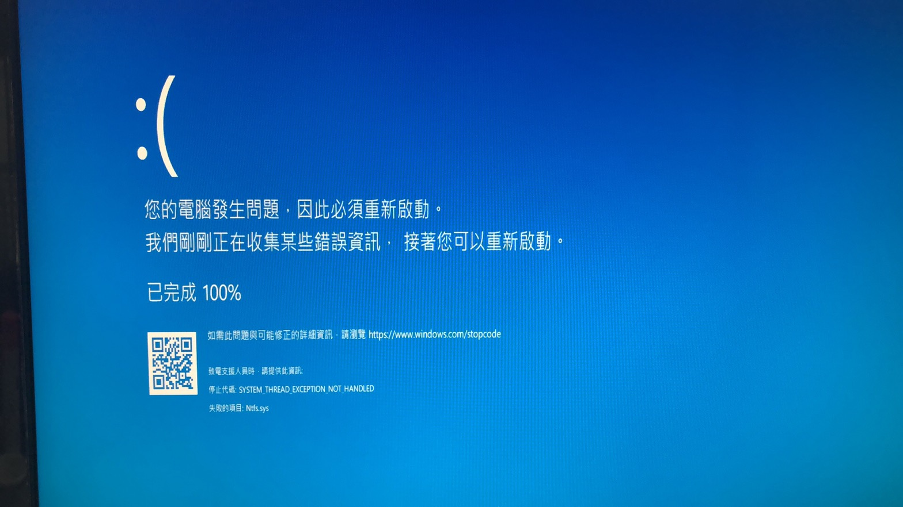

## 蒐集遇到的問題

### 硬體配備

OS: Windows 11

CPU: Intel i7-8700

GPU: GIGABYTE GTX-970

Motherboard: ASUS H310M-K

RAM: Micron 16GB x 2 (Dual)

外接硬碟可讀取但無法進入，使用以下指令修復後已可開啟。

`chkdsk X: /r`

但沒多久就出現無限藍屏自動修復迴圈中。

錯誤代碼:`SYSTEM_THREAD_EXCEPTION_NOT_HANDLED`

失敗的項目:`Ntfs.sys`

### 交叉測試

拔掉硬碟後可正常開機，但只要插上外接硬碟又會出現相同錯誤，
嘗試進入安全模式使用指令`chkdsk X: /r` 修復，
但只要插上硬碟就馬上藍屏，外接硬碟在 Mac 可以正常讀取但檔案容量太大無法備份到 Mac 上。

### 解決方法

購買 PikPak 月費方案並從 Mac 讀取硬碟後備份檔案上去，再買一顆硬碟從雲端備份下來。

### 原因

初步判斷是 Windows 11 造成的問題，會再 Windows 10 的環境交叉測試。
